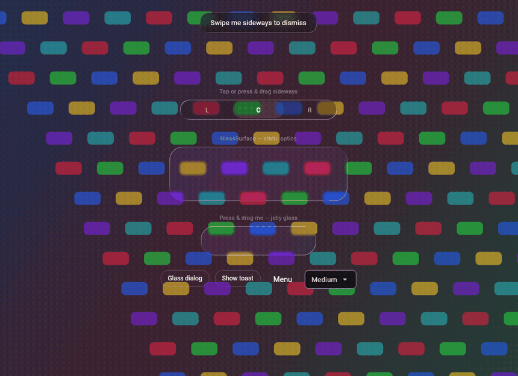

# flutter_liquid_glasses

[English](README.md) · 中文

Flutter 上的 Apple 风格**液态玻璃**材质（Impeller）——
忠实移植 [Kyant 的 AndroidLiquidGlass](https://github.com/Kyant0/AndroidLiquidGlass)
光学实现（`backdrop` 库），并扩展到桌面级表面。

真折射、真色散、真弹簧——不是模糊磨砂的近似。



## 渲染能力

- **SDF 裁剪的玻璃边缘** —— ±0.5px 抗锯齿边界，不是软渐变
- **透镜折射** —— 沿圆角矩形 SDF 梯度的 `circleMap` 位移，
  可选 `depthEffect`（法线向径向弯曲）
- **7 路色散** —— ROYGCBP 分通道采样（圆角处的棱镜彩边）
- **鲜活度控制** —— 对背景应用饱和度/亮度/对比度矩阵，
  与 Kyant 的 `colorControls` 一致
- **Hue 混合染色 + 盖面色** —— 不可分离 Hue 混合保留背景亮度，
  再叠加 SrcOver 盖面
- **方向性高光** —— SDF 梯度边缘光照（Kyant `Highlight.Default`），
  另有均匀描边模式
- **内阴影** —— 裁剪的 `blur(S − translate(S))` 技巧，
  隔离处理保证 `Clear` 不会擦除场景
- **交互 glow** —— 指针跟随的径向 Plus 高光
  （0.08 平光 + 0.15 径向，Kyant `InteractiveHighlight`）
- **闭式解阻尼弹簧** —— 欠阻尼按压/拖拽/沉降运动
  （k=300 ζ=0.5、k=250 ζ 0.6/0.7、k=1000 ζ=1.0——与 Kyant
  `DampedDragAnimation` 相同常数）
- **诚实降级** —— `ReducedTransparencyScope`（无障碍）与
  非 Impeller 磨砂回落；不是玻璃时绝不假装是玻璃

## 环境要求

- Flutter ≥ 3.35，**Impeller 渲染**（现代 iOS/Android/桌面默认开启）
- 折射依赖 `ImageFilter.shader`，该 API **只在 Impeller 上存在**。
  其他后端——**包括 Flutter web**（CanvasKit 和 Skwasm 都是 Skia，
  不是 Impeller）——所有表面降级为 blur + tint 磨砂
  （不崩溃、不伪造折射）。弹簧、手势、高光绘制、染色控制在
  降级下仍然有效；镜片/色散参数按设计失效。

## 用法

```dart
import 'package:flutter_liquid_glasses/flutter_liquid_glasses.dart';

// 静态玻璃表面。
Stack(
  children: [
    myBackdropContent,
    GlassSurface(
      params: const GlassParams(
        cornerRadius: 20,
        refractionHeight: 18,
        refractionAmount: -34,
        depthEffect: 1,
        chromatic: 2.0,
        saturation: 1.5,
      ),
      blurSigma: 2,
      child: myForegroundContent,
    ),
  ],
)

// 交互表面：按压形变 + 拖拽果冻 + 指针 glow。
GlassPressSurface(
  params: GlassMaterials.composer(GlassTheme.of(context)).params,
  child: myButton,
)

// 滑动消除（toast、chip）。
LiquidSwipeSurface(
  onDismissed: () => hideToast(),
  child: toastCard,
)

// 折射拇指分段选择器（Kyant LiquidBottomTabs）：
// 按下时拇指膨胀成活透镜探出轨道，拖拽经临界阻尼弹簧滞后跟随，
// 松手到位后才泄压——点击切换则平滑滑行不产生形变。
GlassSegmentedControl<int>(
  segments: const [
    GlassSegment(value: 0, label: '左'),
    GlassSegment(value: 1, label: '中'),
    GlassSegment(value: 2, label: '右'),
  ],
  selected: tab,
  onChanged: (v) => setState(() => tab = v),
)

// 材质配方 + 染色。
final material = GlassMaterials.overlay(GlassTheme.of(context));
GlassDialog(child: dialogBody);              // 浮层档位壳
showGlassMenu(context: context, anchor: pos, // 玻璃弹出菜单
    items: [GlassMenuItem(value: 1, child: Text('Item'))]);
```

## 上游保真度

本包是 Kyant AGSL/Kotlin 实现的逐行移植。有偏差之处均为有意为之且已记录：

| 本包（`GlassParams`） | Kyant `backdrop` | 状态 |
|---|---|---|
| `refractionHeight` / `refractionAmount` | `lens(refractionHeight, refractionAmount)` | 数学一致；保留符号约定（负值 = 内吸） |
| `depthEffect` | `depthEffect` | 一致 |
| `chromatic`（float，0 = 关） | `chromaticAberration`（bool，uniform 固定 `1f`） | **偏差**——本包兼任强度系数 |
| `saturation`/`brightness`/`contrast` | `colorControls(brightness, contrast, saturation)` | 矩阵一致 |
| `tintColor` + `surfaceColor` | 分开绘制的表面层 | 合并进 shader pass |
| highlight stroke/blur/alpha/angle/falloff | `Highlight(width, blurRadius, alpha, style)` | 管线一致；上游 `Ambient` 风格未移植（roadmap） |
| `shadow*` | `InnerShadow` | 技巧一致 |
| `glow*` | `InteractiveHighlight` | 权重一致（0.08 平光 + 0.15 径向，半径 = minDim·1.5） |
| `GlassSpring` k/ζ | `DampedDragAnimation` 弹簧规格 | 常数相同，闭式解替代 `Animatable` |
| `cornerRadius`（统一） | `cornerRadii`（逐角） | **简化**——逐角半径在 roadmap |

## 平台说明

桌面是一等目标：完整管线（折射 + 色散 + glow）在 Windows/Impeller 上
运行。widget 测试直接覆盖 shader 数学；AA 边缘的预乘 alpha 正确性
逐像素断言。

## 致谢

光学与交互设计移植自
**[Kyant0/AndroidLiquidGlass](https://github.com/Kyant0/AndroidLiquidGlass)**
（Apache-2.0）——其 `backdrop` 库是本包跟踪的参考实现。
非常感谢 Kyant 的开源工作。

## 许可证

Apache-2.0。见 [LICENSE](LICENSE) 与 [NOTICE](NOTICE)。
